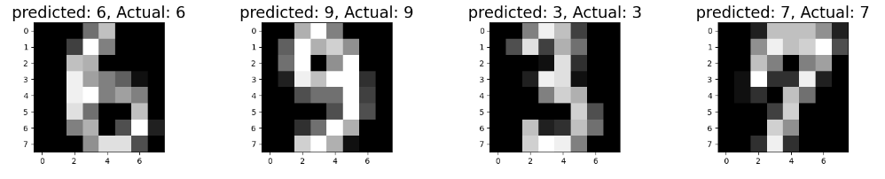
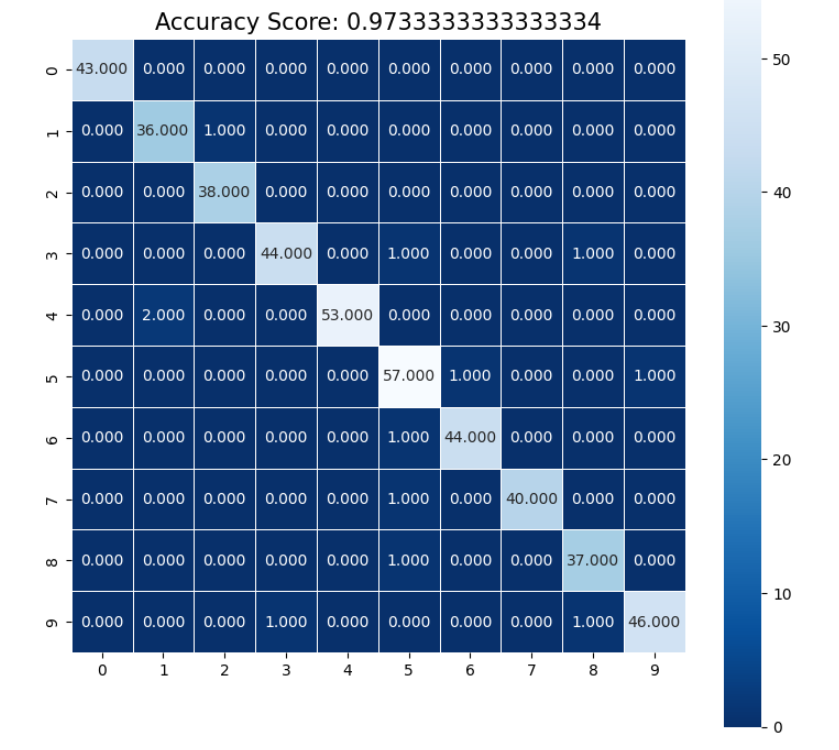

# Handwritten Digit Recognition

Handwritten Digit Recognition is a machine learning project that involves the development of a model capable of recognizing handwritten digits. The ML model achieved an accuracy score of 97.33% and was trained using a logistic regression linear model from the Scikit-learn library. The training dataset used for this project is the popular `load_digits` dataset, and the model achieved an impressive r2_score of 0.967.

## Features

1. **Logistic Regression Model**
   - Utilizes the logistic regression linear model from Scikit-learn for handwritten digit recognition.

2. **High Accuracy**
   - Achieves an accuracy score of 97.33% on the recognition of handwritten digits.

3. **Training Dataset**
   - Trains the model on the widely-used `load_digits` dataset.

4. **R2 Score**
   - Achieves an r2_score of 0.967, indicating the model's robust performance.

## How it Works

The project uses a logistic regression linear model to recognize handwritten digits. The model is trained on the `load_digits` dataset, a popular dataset for digit recognition. The achieved accuracy of 97.33% and an r2_score of 0.967 demonstrate the effectiveness of the developed model in accurately identifying handwritten digits.

## Screenshots





## How to Run

1. Clone the repository.
   ```bash
   git clone https://github.com/gagarinrout/handwritten-digit-recognition.git

2.Run the notebook or script to train and evaluate the model.

